# Introduction

## Statistics & Biostatistics {.tabset}

### Some Definitions (总体、样本、参数、统计量、变量)

* `Population`: the complete collection of units (individuals or objects) of interest in a study.

* `Parameter (the truth)`: any descriptive measure based on a population (a single-value parameter or a complicated function)

* `Sample`: a smaller subset of the population of interest

* `Statistic (approximation of the truth, prone to error)`: any descriptive measure (of the parameter) based on a sample (synonym: Estimator)

——The true Parameter is invariant to the Sample.

* `Variable`: a characteristic of each element of a population or sample

### Sampling (抽样)


Statistical inference allows generalization from the sample only to the population from which the sample came from (assuming no sampling and response bias!).

If we want to make inference about the target population, we have to make sure that the population from which the sample came from is similar to the target population.

**Sampling Populations**

* The ability to obtain reliable measures of population depends critically on how we sample populations.

Properties of good samples:

* Low sampling error, focus on `precision`

* `Accurate` (or unbiased) estimates

Bias v.s. Variance

* `Bias`: tendency of being inaccurate

* `Variance`: uncertainty due to randomness of samples

### Types of (structured) Data

* `Qualitative data`: measurements expressed not in terms of numbers but in types or categories.

* `Qualitative variables` can be subdivided into: 

`Ordinal variables`: ordered series (e.g., preference, disease severity)

`Nominal variables`: no inherent order or ranking (e.g., blood type)

`Binary variables`: only two options (e.g., pass/fail, yes/no)

* `Quantitative data`: measurements expressed in terms of numbers:
e.g., weight, blood pressure, survival time, etc.

* `Quantitative variables` can also be subdivided into:

`Discrete variables`: usually there are gaps between the values
e.g., # of pregnancies

`Continuous variable`s: have a set of all possible values within an
interval. e.g., body mass index (BMI)


### Sources of Data

* `Published Source`: government, business, sports statistics are collected and presented in press, online, etc.

* `Experimental Study`: researchers deliberately influence events and investigate the effects of an intervention

* `Survey`: researchers select sample of individuals and record their responses to questions

* `Observational Study`: researchers collect information on the attributesor measurements of interest, without influencing the events

### Study Design

* Experimental


* Observational

Observational studies are to be contrasted with experiments.

• No intervention

• Data collected on an already existing system (practical, less expensive, feasible)

Types of observational studies:

• Case study: descriptive characteristics of a single subject

• Case-control study


• Cross-sectional study


• Cohort studies


## R code -- Data Maniplulation {.tabset}

### Importing Data 读取数据

Here we read csv files `lowbwt_Low.csv` and `lowbwt_Normal.csv`

You will need to change the working directory to your personal file location.

```{r, message=FALSE}
# read and name data 读取并命名数据
low_birth = read.csv("Module 1/lowbwt_Low.csv")
norm_birth = read.csv("Module 1/lowbwt_Normal.csv")
```

### Examine Data Attributes 检查数据属性

```{r, message=FALSE}
# Variable names 列变量名称
names(low_birth)    

# Data dimension: rows x columns; here: 59 rows and 3 columns 数据维度：行×列
dim(low_birth)

# Number of rows 行数
nrow(low_birth)

# Number of columns 列数
ncol(low_birth)

# Head and Tail observations 开头和结尾的观察量
head(low_birth)
tail(low_birth)

# Check for number of missing values 检查缺失值数量
sum(is.na(low_birth))

# Examine the classes of each column 检查每列的变量类型
str(low_birth)

# Tabulate variable smoke ???
table(low_birth$smoke)
```

### Data Manipulation using `dplyr` 用“dply”进行数据模拟

Note: to apply these changes to the existing data, you must reassign the change.

i.e. `low_birth = filter(low_birth, age < 20)`

NOTE: you will need to install the `{tidyverse}` package.  Run `install.packages("tidyverse")` in the Console.

```{r, message=FALSE}
library(tidyverse)
```

```{r, message=FALSE}
# Select only column/variable age 只选择一列变量
dplyr::select(low_birth, age)

# Keep only rows where 'age' is less than 20 只保留年龄＜20的行
filter(low_birth, age < 20)

# Select rows that contain missing data 选择包括缺失值的行
filter(low_birth, is.na(age))

# Remove column age 去掉“年龄”这一列
dplyr::select(low_birth, -age)

# Filter rows: select all 25+ yrs old, smokers 选择所有年龄＞25，抽烟的行
filter(low_birth, age > 25 & smoke == "1") 

# Ordering data by variable/column 'id' 按照“id”对数据排列
arrange(low_birth, id)

# Arrange by id in descending order 按id降序对数据排列
arrange(low_birth, desc(id))

# Order by multiple columns/variables 按照多列变量排序
arrange(low_birth, smoke, desc(age))

# Rename variable 'smoke' to 'Smoking_Status' 对“抽烟”重新命名
rename(low_birth, Smoking_Status = smoke)

# Create a variable for log of 'age' 创建新的变量为“年龄”的对数
mutate(low_birth, log_age = log(age))

# Centering the data by subtracting the mean from variable 'age' 从变量 "年龄 "中减去平均值，使数据居中
mutate(low_birth, center_age = age - mean(age))

# Use case_when function to create new age categories 使用 case_when 函数创建新的年龄类别
# Cat 1: Age < 25; Cat 2: 25 < Age < 30. Cat 3: Age > 30
mutate(low_birth, new_age = case_when(age < 25 ~ 1,
                                      age >= 25 & age < 30 ~ 2,
                                      age > 30 ~ 3))

```

### Combine Data Sets 合并数据集

```{r,message=FALSE}
# stack low_birth & norm_birth 
low_and_norm = rbind(low_birth, norm_birth)

# combine by specific variable
admin_birth = read.csv("Module 1/lowbwt_Admin.csv")
birth_final = full_join(admin_birth, low_and_norm, by = "id")

# export data 
write.csv(birth_final, file = "Module 1/birth_final.csv")
```


# Descriptive Statistics 描述性统计

## Measures of Location = central tendency {.tabset}

### Mean (average)平均数

`Definition`: the arithmetic mean represents the sum of all observations divided by the total number of observations


* The most common used measure of location

* Overly sensitive to outliers (unusual observations).

* Not appropriate for nominal or categorical variables (how to characterize their mean?)

Convert to binary variables: calculate the frequencies / proportions of blood types A, B and O (the mean of appearance of each type).

* Why “mean” is a good measure of the location / center?

  *  It is the measure that includes all the values in the data set for its calculation, and any change in any of the scores will affect the value of the mean.

### Median (the 50 th percentile) 中位数

Definition: The sample median is computed as:

1. If n is odd, median is computed as [(n+1)/2]^th^ largest item in the sample

2. If n is even, computed as the <u>average</u> of (n/2) and [(n/2)+1]^th^ largest items

* Compared to the mean, the median is not affected by every value in the data set including outliers.

* Median is usually an appropriate measure for ordinal data.

### Percentiles 百分位数

Defination: In general the k^th^ percentile is a value such that most k% of the data are smaller than it and (100-k)% are larger than it.

* Median is the 50^th^ percentile

* Quartiles: 25^th^ (Q1), 50^th^ , 75^th^ (Q3)

* Deciles: 10^th^ , 20^th^ , 30^th^ , ...

### Mode 众数

Definition: the most frequently occurring value in the data

It becomes problematic for large number of possible values with infrequent occurrence (continuous variables).

* How to fix this problem?

Discretize the data (intervals, histograms). 数据离散化（区间、直方图）

### Understanding of location measures

* How do we define the “center” (location)? 
  * Some point having the smallest dispersion (distance) to the sample points (in sum or average). 
  
* How do we define distance or dispersion?
  * A common choice: (𝑥! −𝑎) " as the distance between 𝑥! and 𝑎.

* How do we define distance or dispersion?
  * 


# Module 3


# Module 4


# Module 5


# Sampling Distributions 抽样分布

*Law of Large Numbers* → justify the consistency of the sample means

*Central Limit Theorem* → calculate approximate probabilities for sample means

## Sampling Distributions {.tabset}

### Sampling Distributions

The usual way to obtain information regarding a population parameter such as: 𝜇, 𝜎^2, or 𝑝, is by drawing a sample from a population and compute a statistics (sample characteristic).

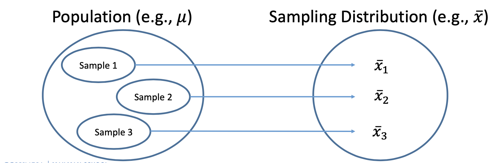

The observed value/statistic depends on the particular sample selected, and it varies from sample to sample → *sampling variability*

The distribution of (the value of) the statistic is called the *sampling distribution*

* The sampling distributions can be described by measures of central tendency and spread. This is informative in predicting how close a statistic falls to the population parameter it estimates (testing, confidence interval).

### Estimation of the Mean of a Distribution


## LLN 大数定律 {.tabset}


## CLT 中心极限定理 {.tabset}

## R Code


# 统计推断方法

置信区间→推断总体参数所在的范围
假设检验→推断总体参数之间是否不同

## 置信区间估计

置信区间（CI）：估计值±误差范围

高置信度=结果准确性高

误差范围= 结果精确性高

减小误差范围m的方法：① 选择较低的置信度——减小z' ② 选择更大的样本量n ③ 减小拉姆达

## 假设检验

假设检验=反证法+小概率思想

基本步骤：

（一）建立假设检验，确定检验水准

null hypothesis 零假设

H0：两总体均数无差异

备择假设

H1：两总体均数有差异

检验水准 α

（二）统计量的选择与计算

Z = （估计值-假设检验值）/估计值的标准误

（三）计算P值，做出统计推断

P值：在H0成立的条件下，计算现有样本统计量以及更极端情况的概率，称为假设检验的P值。

统计推断结论：

若P≤α，按照α水准拒绝H0，接受H1，可以认为总体参数之间的差异有统计学意义。
若P≥α，按照α水准不拒绝H0，尚不能认为总体参数之间的差异有统计学意义。

## 检验效能与基于决策的推断

检验效能（power of test)

检验水准为α，当H1为真时，假设检验能够拒绝H0的概率

一类错误：当H0为真时，拒绝H0  犯一类错误的概率=检验水准α
二类错误：当H1为真时，拒绝H1  犯二类错误的概率=β，检验效能=1-β

# Methods of Inference: One-Sample Mean 推断方法：单样本均数{.tabset}

## Samping distribution 抽样分布

* The observed value depends on the particular sample selected, and it varies from sample to sample -> *sampling variability*.

* The distribution of the values of the statistic is called *sampling distribution*.

## Statistical Inferences 统计推断{.tabset}

Statistical inferences include:

###  Point Estimation

* A point estimate is a single number computed from the sample, that can be regarded as a plausible value of the population parameter (characteristics).

* Because of sampling variability, rarely is the point estimate exactly equal to the true parameter.

  * Solution: construct a confidence interval (CI) that contains plausible values for the population parameter.


### Interval Estimation

#### 总体标准差已知
  
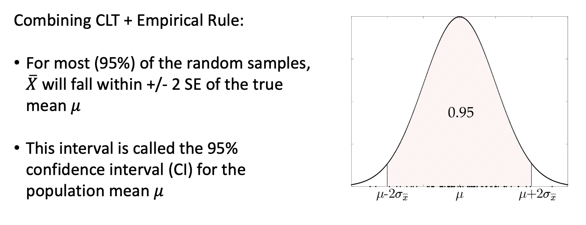

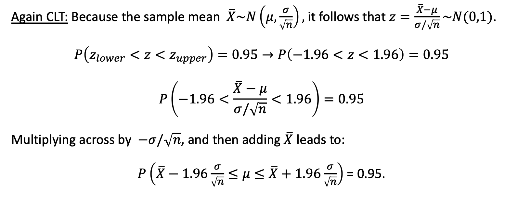

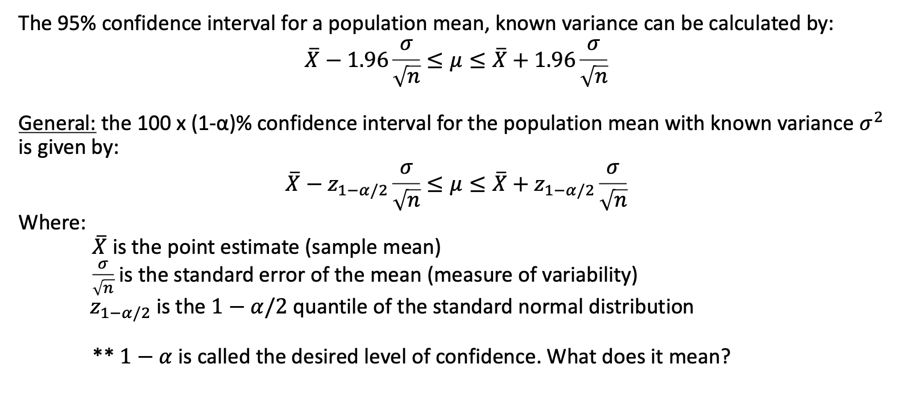

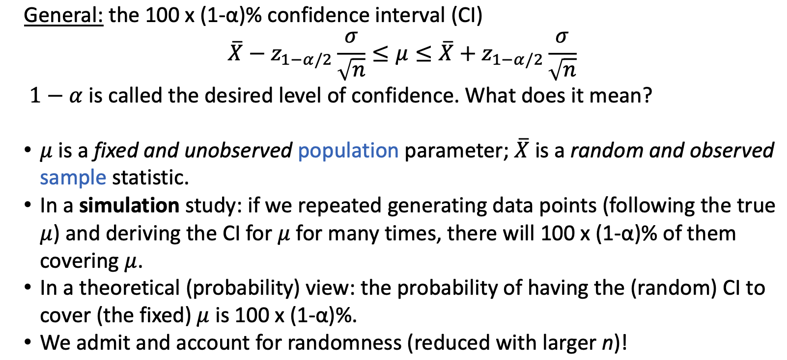

* 95% CI: Interpretations

1. Over the collection of all 95% confidence intervals that could be constructed from repeated samples of size n, 95% of them will contain the true population mean.
1. 在所有可以从大小为 n 的重复样本中构建的 95% 置信区间集合中，95% 的置信区间将包含真实的总体平均值。

2. We are 95% confident that the true population mean lies between the lower and the upper limits of the interval.
2. 我们有 95% 的把握认为，真实的人口平均值位于区间的下限和上限之间。

#### 总体标准差未知do not know the true 𝜎 but only know the sample standard deviation?


#### Two vs One-Sided Confidence Intervals

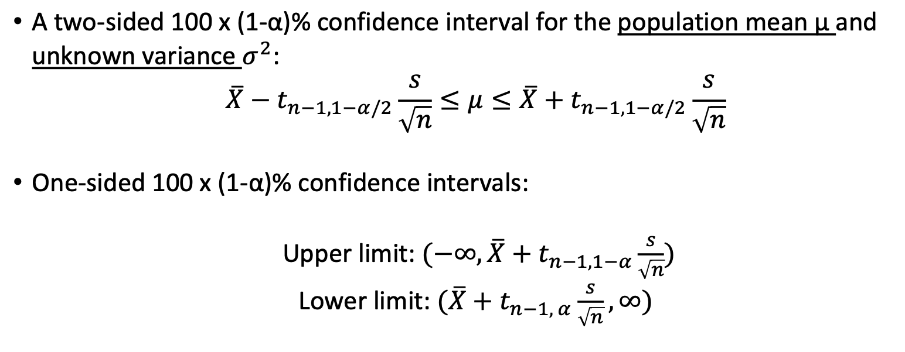

#### Variance Estimation

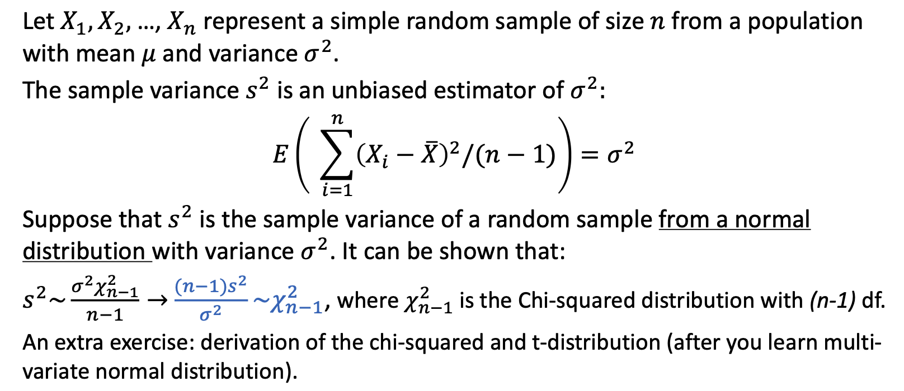


### Hypothesis Testing

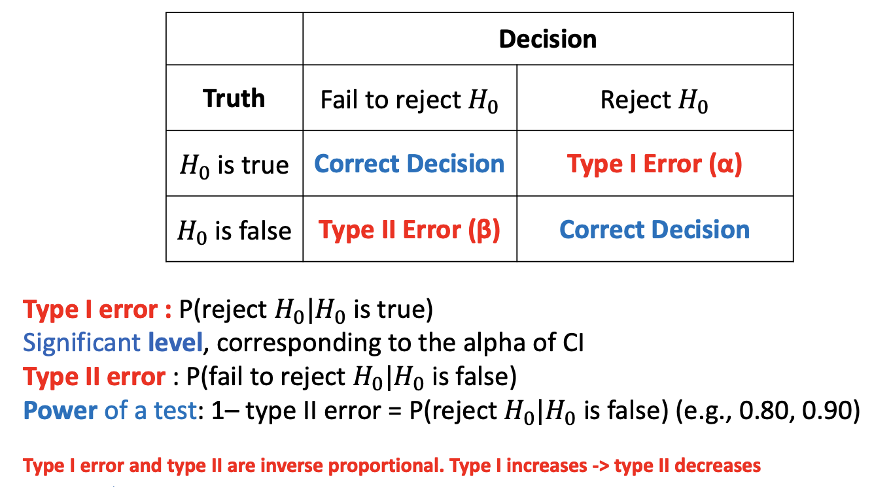

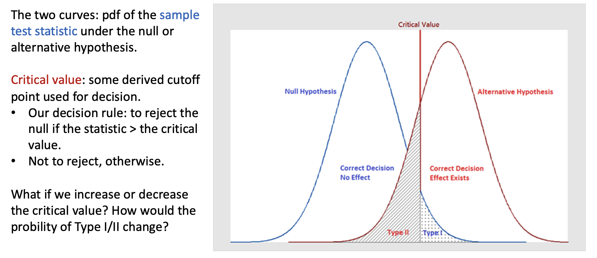

How to Conduct Hypothesis Testing
1. State the question of interest!
2. Specify the parameter of interest; set up the null/alternative hypotheses and the
significance level;
3. Clearly state the statistical methodology to be used and assumptions - why?;
4. Collect the data;
5. State the test statistic and determine the critical values/region;
6. Interpret the findings in the context of the question/problem;
7. Draw conclusions and compare the results to other findings (if available).

1. 说明感兴趣的问题！
2. 指定感兴趣的参数；设定零假设/备择假设和显著性水平；
3. 明确说明要使用的统计方法和假设--为什么？
4. 4. 收集数据；
5. 说明检验统计量并确定临界值/区域；
6. 根据问题的背景解释结果；
7. 得出结论，并将结果与其他结果（如有）进行比较。

#### One-Sample, 1-sided Tests 单样本单侧检验

Known Variance 已知标准差


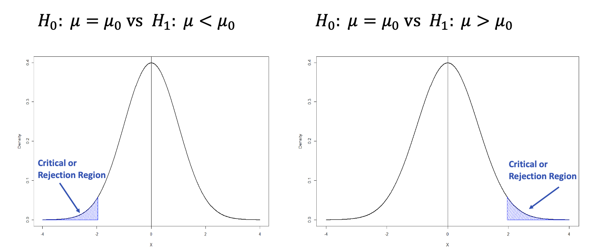

Unknown Variance 未知标准差


#### One-Sample, 2-sided Tests 单样本双侧检验

Known Variance 已知标准差

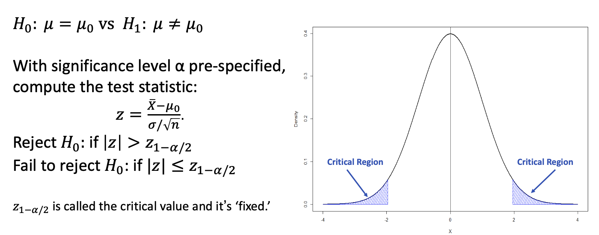

Unknown Variance 未知标准差

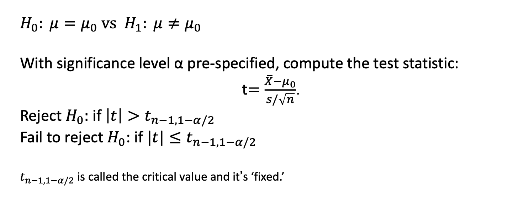

### Prediction


## R code{.tabset}

### Sample Mean Distributions: CLT
Draw 1000 (N) samples of size 10 (n) from an underlying exponential distribution with parameter lambda = 0.3.
从参数为 lambda = 0.3 的指数分布中抽取 1000 (N) 个大小为 10 (n) 的样本

```{r, message=FALSE}
#  define parameters 定义参数
n = 10
N = 1000
lambda = 0.3
set.seed(2)

# create vector of sample means 创建样本均值向量
sample_means_exp1 = c()
for(i in 1:N){
sample_means_exp1[i] = mean(rexp(n, lambda))
}
```

Calculate their means and variances and draw a histogram to vizualize the sample mean
distribution.
计算它们的均值和方差，并绘制直方图以显示样本均值分布。

```{r,message=FALSE}
mean(sample_means_exp1)
var(sample_means_exp1)
hist(sample_means_exp1,
main = "Samples of Size n = 10 from Exp(0.3)",
xlab = "Sample Means", prob = T)
lines(density(sample_means_exp1), col = "darkblue", lwd = 2)
```

Draw 1000 (N) samples of size 50 (n) from an underlying exponential distribution with parameter lambda = 0.3.
从参数 lambda = 0.3 的指数分布中抽取 1000 (N) 个大小为 50 (n) 的样本。

```{r}
# define parameters
n = 50
N = 1000
lambda = 0.3
set.seed(2)

# create vector of sample means
sample_means_exp1 = c()
for(i in 1:N){
sample_means_exp1[i] = mean(rexp(n, lambda))
}
```

Calculate their means and variances and draw a histogram to vizualize the sample mean distribution.

```{r,message=TRUE}
mean(sample_means_exp1)
var(sample_means_exp1)
hist(sample_means_exp1,
main = "Samples of Size n = 50 from Exp(0.3)",
xlab = "Sample Means", prob = T)
lines(density(sample_means_exp1), col = "darkblue", lwd = 2)
```

### Confidence Intervals

Construct a 95% CI for the population mean with 𝑛 = 10, 𝑋 = 175, and known (population)
𝜎 = 15.
在𝑛 = 10、𝑋 = 175 和已知（人口）𝜎 = 15 的条件下，构建人口平均值的 95% CI。

```{r,message=FALSE}
lower = 175 - qnorm(0.975) * 15/sqrt(10)
upper = 175 + qnorm(0.975) * 15/sqrt(10)
c(lower, upper)
```

Construct a 99% CI for the population mean with 𝑛 = 10, 𝑋 = 175, and known (population) 𝜎 = 15.

```{r,message=FALSE}
lower = 175 - qnorm(0.995) * 15/sqrt(10)
upper = 175 + qnorm(0.995) * 15/sqrt(10)
c(lower, upper)
```

Construct a 95% CI for the population mean with 𝑛 = 10, 𝑋 = 175, 𝑑𝑓 = 10 - 1 = 9 and
known (sample) 𝑠 = 15.

```{r,message=FALSE}
lower = 175 - qt(0.975, df = 9) * 15/sqrt(10)
upper = 175 + qt(0.975, df = 9) * 15/sqrt(10)
c(lower, upper)
```

Construct a 95% CI for the population variance with known s = 15.

```{r,message=FALSE}
lower = 9*(15^2) / qchisq(0.975, 9)
upper = 9*(15^2) / qchisq(0.025, 9)
c(lower, upper)
```

### Hypothesis Testing

Calculate the test statistic for testing if the population mean is different from 25 given 𝑋 = 16, 𝑠 = 10, and 𝑛 = 40. Compare to the critical value and calculate the p-value at the 0.05 level.
给定 𝑋 = 16，𝑠 = 10，𝑛 = 40，计算检验人口平均值是否不同于 25 的检验统计量。比较临界值，计算 0.05 水平的 p 值。

```{r,message=FALSE}
# test statistic
tstat = (16 - 25) / (10/sqrt(40))
# critical value
cv = qt(0.975, df = 40 - 1)
# p-value
pv = 2 * pt(tstat, df = 39)
# decision
ifelse(abs(tstat) > cv, "reject", "fail to reject")
```

```{r,message=FALSE}
ifelse(pv < 0.05, "reject", "fail to reject")
```

Using the “lowbwt_ALL.csv” data, test if the true mean bwt is different than 3000g.

```{r,message=FALSE}
# load data
lowbwt = read.csv("Module 7/lowbwt_ALL.csv")
# one-sample, two-tailed t-test
t.test(lowbwt$bwt, alternative = 'two.sided', mu = 3000) # fail to reject
```

Test if the true mean is less than 3000g.

```{r,message=FALSE}
# one-sample, one-tailed t-test
t.test(lowbwt$bwt, alternative = 'less', mu = 3000) # fail to reject
```

# Module 8


# Module 9


# Module 10


# Module 11


# Module 12


