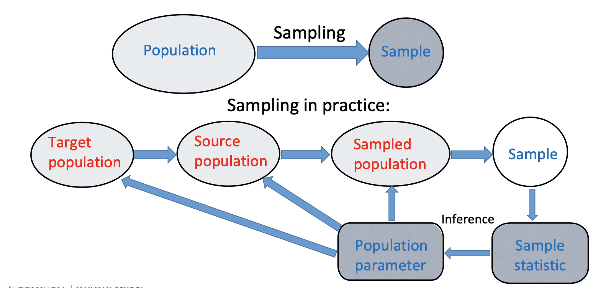
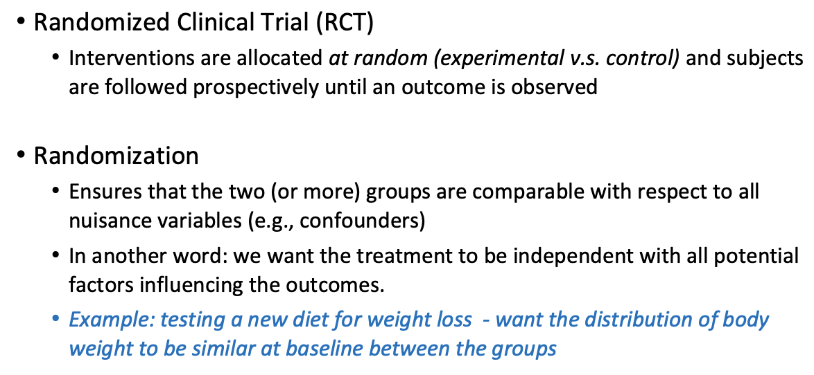
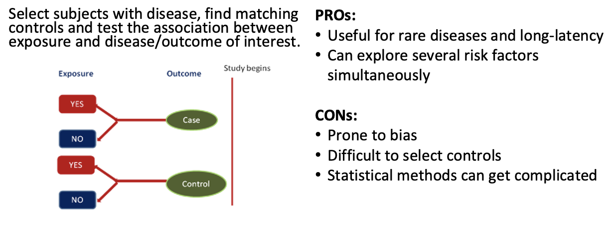
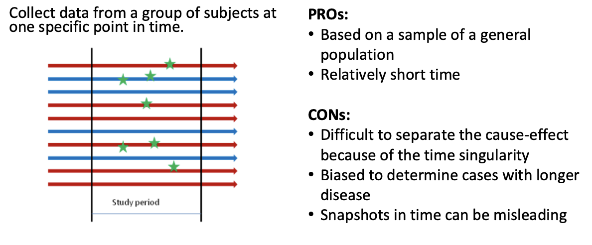
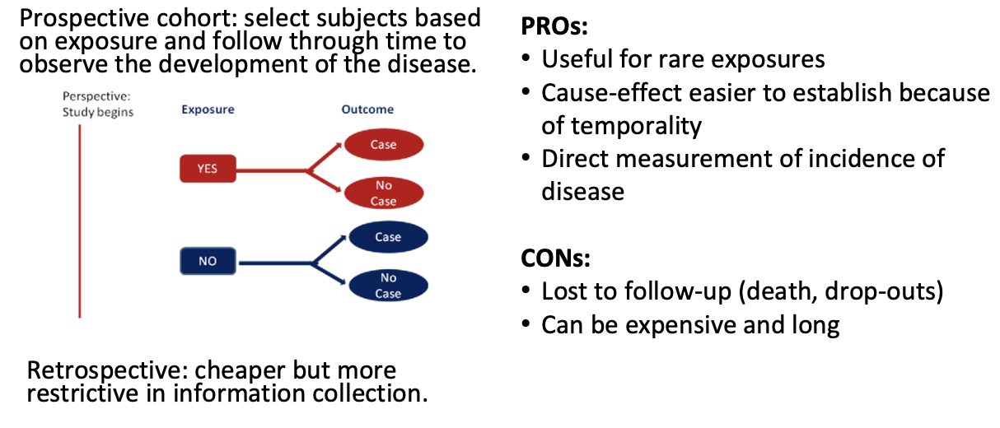

# Module 1 Introduction

## Statistics & Biostatistics {.tabset}

### Some Definitions (总体、样本、参数、统计量、变量)

* `Population`: the complete collection of units (individuals or objects) of interest in a study.

* `Parameter (the truth)`: any descriptive measure based on a population (a single-value parameter or a complicated function)

* `Sample`: a smaller subset of the population of interest

* `Statistic (approximation of the truth, prone to error)`: any descriptive measure (of the parameter) based on a sample (synonym: Estimator)

——The true Parameter is invariant to the Sample.

* `Variable`: a characteristic of each element of a population or sample

### Sampling (抽样)



Statistical inference allows generalization from the sample only to the population from which the sample came from (assuming no sampling and response bias!).

If we want to make inference about the target population, we have to make sure that the population from which the sample came from is similar to the target population.

**Sampling Populations**

* The ability to obtain reliable measures of population depends critically on how we sample populations.

Properties of good samples:

* Low sampling error, focus on `precision`

* `Accurate` (or unbiased) estimates

Bias v.s. Variance

* `Bias`: tendency of being inaccurate

* `Variance`: uncertainty due to randomness of samples

### Types of (structured) Data

* `Qualitative data`: measurements expressed not in terms of numbers but in types or categories.

* `Qualitative variables` can be subdivided into: 

`Ordinal variables`: ordered series (e.g., preference, disease severity)

`Nominal variables`: no inherent order or ranking (e.g., blood type)

`Binary variables`: only two options (e.g., pass/fail, yes/no)

* `Quantitative data`: measurements expressed in terms of numbers:
e.g., weight, blood pressure, survival time, etc.

* `Quantitative variables` can also be subdivided into:

`Discrete variables`: usually there are gaps between the values
e.g., # of pregnancies

`Continuous variable`s: have a set of all possible values within an
interval. e.g., body mass index (BMI)


### Sources of Data

* `Published Source`: government, business, sports statistics are collected and presented in press, online, etc.

* `Experimental Study`: researchers deliberately influence events and investigate the effects of an intervention

* `Survey`: researchers select sample of individuals and record their responses to questions

* `Observational Study`: researchers collect information on the attributesor measurements of interest, without influencing the events

### Study Design

* Experimental



* Observational

Observational studies are to be contrasted with experiments.

• No intervention

• Data collected on an already existing system (practical, less expensive, feasible)

Types of observational studies:

• Case study: descriptive characteristics of a single subject

• Case-control study



• Cross-sectional study



• Cohort studies



## R code -- Data Maniplulation {.tabset}

### Importing Data 读取数据

Here we read csv files `lowbwt_Low.csv` and `lowbwt_Normal.csv`

You will need to change the working directory to your personal file location.

```{r, message=FALSE}
# read and name data 读取并命名数据
low_birth = read.csv("Module 1/lowbwt_Low.csv")
norm_birth = read.csv("Module 1/lowbwt_Normal.csv")
```

### Examine Data Attributes 检查数据属性

```{r, message=FALSE}
# Variable names 列变量名称
names(low_birth)    

# Data dimension: rows x columns; here: 59 rows and 3 columns 数据维度：行×列
dim(low_birth)

# Number of rows 行数
nrow(low_birth)

# Number of columns 列数
ncol(low_birth)

# Head and Tail observations 开头和结尾的观察量
head(low_birth)
tail(low_birth)

# Check for number of missing values 检查缺失值数量
sum(is.na(low_birth))

# Examine the classes of each column 检查每列的变量类型
str(low_birth)

# Tabulate variable smoke ???
table(low_birth$smoke)
```

### Data Manipulation using `dplyr` 用“dply”进行数据模拟

Note: to apply these changes to the existing data, you must reassign the change.

i.e. `low_birth = filter(low_birth, age < 20)`

NOTE: you will need to install the `{tidyverse}` package.  Run `install.packages("tidyverse")` in the Console.

```{r, message=FALSE}
library(tidyverse)
```

```{r, message=FALSE}
# Select only column/variable age 只选择一列变量
dplyr::select(low_birth, age)

# Keep only rows where 'age' is less than 20 只保留年龄＜20的行
filter(low_birth, age < 20)

# Select rows that contain missing data 选择包括缺失值的行
filter(low_birth, is.na(age))

# Remove column age 去掉“年龄”这一列
dplyr::select(low_birth, -age)

# Filter rows: select all 25+ yrs old, smokers 选择所有年龄＞25，抽烟的行
filter(low_birth, age > 25 & smoke == "1") 

# Ordering data by variable/column 'id' 按照“id”对数据排列
arrange(low_birth, id)

# Arrange by id in descending order 按id降序对数据排列
arrange(low_birth, desc(id))

# Order by multiple columns/variables 按照多列变量排序
arrange(low_birth, smoke, desc(age))

# Rename variable 'smoke' to 'Smoking_Status' 对“抽烟”重新命名
rename(low_birth, Smoking_Status = smoke)

# Create a variable for log of 'age' 创建新的变量为“年龄”的对数
mutate(low_birth, log_age = log(age))

# Centering the data by subtracting the mean from variable 'age' 从变量 "年龄 "中减去平均值，使数据居中
mutate(low_birth, center_age = age - mean(age))

# Use case_when function to create new age categories 使用 case_when 函数创建新的年龄类别
# Cat 1: Age < 25; Cat 2: 25 < Age < 30. Cat 3: Age > 30
mutate(low_birth, new_age = case_when(age < 25 ~ 1,
                                      age >= 25 & age < 30 ~ 2,
                                      age > 30 ~ 3))

```

### Combine Data Sets 合并数据集

```{r,message=FALSE}
# stack low_birth & norm_birth 
low_and_norm = rbind(low_birth, norm_birth)

# combine by specific variable
admin_birth = read.csv("Module 1/lowbwt_Admin.csv")
birth_final = full_join(admin_birth, low_and_norm, by = "id")

# export data 
write.csv(birth_final, file = "Module 1/birth_final.csv")
```


# Module 2 Descriptive Statistics 描述性统计

## Measures of Location = central tendency {.tabset}

### Mean (average)平均数

`Definition`: the arithmetic mean represents the sum of all observations divided by the total number of observations


* The most common used measure of location

* Overly sensitive to outliers (unusual observations).

* Not appropriate for nominal or categorical variables (how to characterize their mean?)

Convert to binary variables: calculate the frequencies / proportions of blood types A, B and O (the mean of appearance of each type).

* Why “mean” is a good measure of the location / center?

  *  It is the measure that includes all the values in the data set for its calculation, and any change in any of the scores will affect the value of the mean.

### Median (the 50 th percentile) 中位数

Definition: The sample median is computed as:

1. If n is odd, median is computed as [(n+1)/2]^th^ largest item in the sample

2. If n is even, computed as the <u>average</u> of (n/2) and [(n/2)+1]^th^ largest items

* Compared to the mean, the median is not affected by every value in the data set including outliers.

* Median is usually an appropriate measure for ordinal data.

### Percentiles 百分位数

Defination: In general the k^th^ percentile is a value such that most k% of the data are smaller than it and (100-k)% are larger than it.

* Median is the 50^th^ percentile

* Quartiles: 25^th^ (Q1), 50^th^ , 75^th^ (Q3)

* Deciles: 10^th^ , 20^th^ , 30^th^ , ...

### Mode 众数

Definition: the most frequently occurring value in the data

It becomes problematic for large number of possible values with infrequent occurrence (continuous variables).

* How to fix this problem?

Discretize the data (intervals, histograms). 数据离散化（区间、直方图）

### Understanding of location measures

* How do we define the “center” (location)? 
  * Some point having the smallest dispersion (distance) to the sample points (in sum or average). 
  
* How do we define distance or dispersion?
  * A common choice: (𝑥! −𝑎) " as the distance between 𝑥! and 𝑎.

* How do we define distance or dispersion?
  * 


# Module 3


# Module 4


# Module 5


# Module 6


# Module 7


# Module 8


# Module 9


# Module 10


# Module 11


# Module 12


